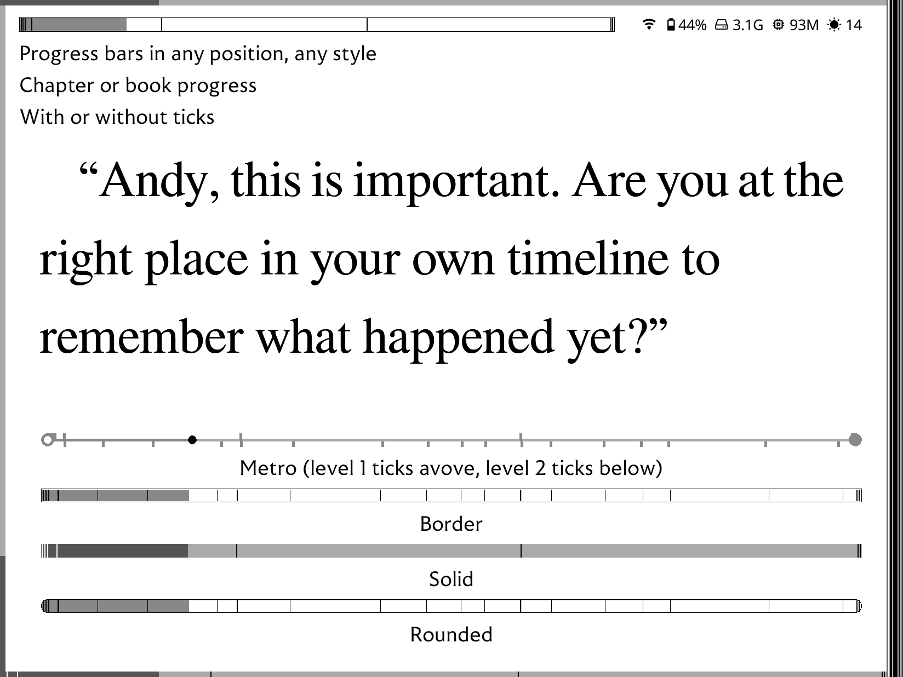
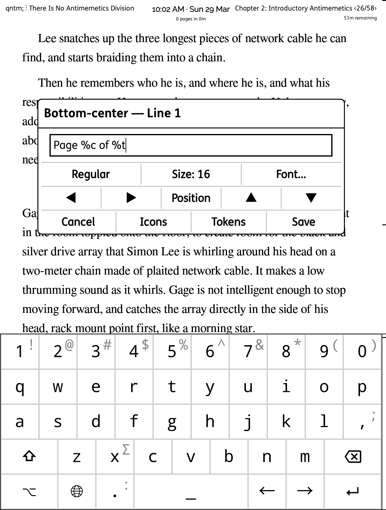
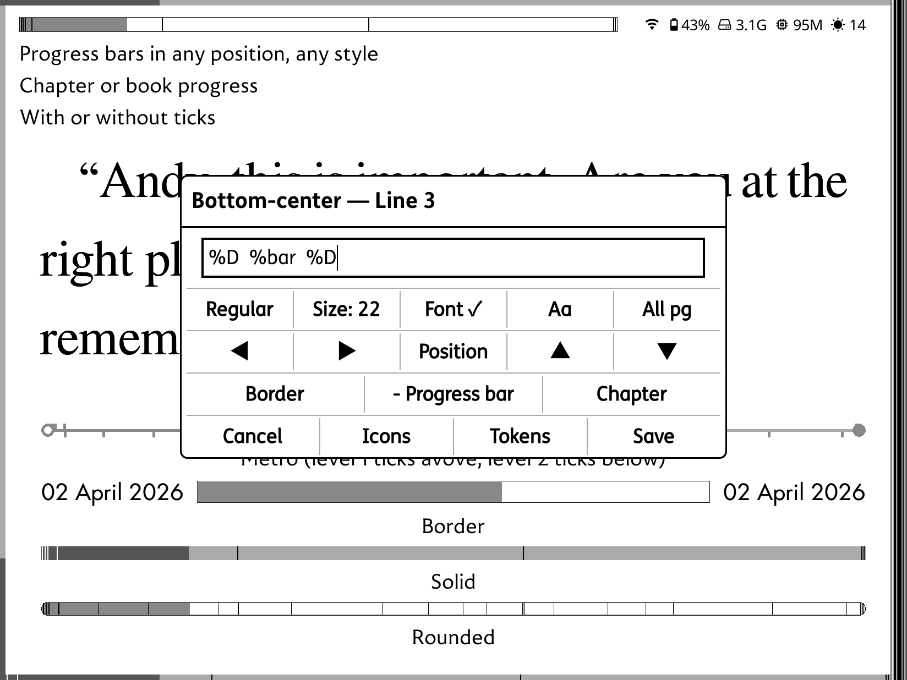

# Bookends

Customisable text overlays for KOReader — page numbers, reading stats, progress bars, clocks, and more, placed anywhere on the reading screen.

### Screenshots

| Title page | Speed Reader | Classic Alternating |
|:---:|:---:|:---:|
|  |  |  |

| Rich Detail | Progress bar styles | Main menu |
|:---:|:---:|:---:|
|  |  |  |

| Line editor | Symbol picker | Token picker |
|:---:|:---:|:---:|
|  |  |  |

| Adjust margins | Progress bar line editor |
|:---:|:---:|
|  |  |

### Quick start

1. Copy `bookends.koplugin/` to your KOReader plugins directory ([paths](#installation))
2. Open a book → **typeset/document menu** (style icon) → **Bookends** → Enable
3. Tap a position (e.g., Bottom-center) → **Add line**
4. Type a format string or use the **Tokens** and **Icons** buttons to insert placeholders
5. Tap **Save** — your overlay appears immediately

### Recipes

A few examples to show how format strings work. Type these in the line editor, or use the **Tokens** and **Icons** buttons to build them visually.

| You type | You get |
|----------|---------|
| `Page %c of %t` | Page 42 of 218 |
| `%p %bar` | 19% ━━━━━━━░░░░░░░░░░░ |
| `%k  %B` | 2:35 PM 🔋 |

You don't need to memorise tokens — the editor has a **Tokens** picker with the full list, and a **live preview** that updates as you type. The built-in presets and the token reference below cover much more.

### Built-in presets

Three presets are included to get you started — load one and customise from there:

- **Speed Reader** — Session timer, reading speed, time remaining, progress percentages
- **Classic Alternating** — Book title on even pages, chapter on odd, page number at bottom
- **Rich Detail** — All six positions with clock, battery, Wi-Fi, brightness, highlights, and more

Save your own presets via **Presets > Custom presets > Create new preset from current settings**.

### Screen positions

```
 TL              TC              TR
 ┌──────────────────────────────────┐
 │                                  │
 │          (reading area)          │
 │                                  │
 └──────────────────────────────────┘
 BL              BC              BR
```

Six positions: **Top-left**, **Top-center**, **Top-right**, **Bottom-left**, **Bottom-center**, **Bottom-right**. Each position can have multiple lines of text.

---

## Reference

Everything below is the full feature reference. Expand any section you need.

<details>
<summary><strong>Tokens</strong> — all available placeholders</summary>

Tokens are placeholders that expand to live values. Type `%` followed by a letter, or use the **Tokens** button in the line editor.

#### Metadata

| Token | Description | Example |
|-------|-------------|---------|
| `%T` | Document title | *The Great Gatsby* |
| `%A` | Author(s) | *F. Scott Fitzgerald* |
| `%S` | Series with index | *Dune #1* |
| `%C` | Chapter/section title (deepest level) | *Chapter 3: The Valley* |
| `%C1`…`%C9` | Chapter title at TOC depth N (menu shows 1–3; deeper levels work when typed manually) | `%C1` → *Part II*, `%C2` → *Chapter 3* |
| `%N` | File name (no path/extension) | *The_Great_Gatsby* |
| `%i` | Book language | *en* |
| `%o` | Document format | *EPUB* |
| `%q` | Number of highlights | *3* |
| `%Q` | Number of notes | *1* |
| `%x` | Number of bookmarks | *5* |

#### Page / Progress

| Token | Description | Example |
|-------|-------------|---------|
| `%c` | Current page number | *42* |
| `%t` | Total pages | *218* |
| `%p` | Book percentage read | *19%* |
| `%P` | Chapter percentage read | *65%* |
| `%g` | Pages read in chapter | *7* |
| `%G` | Total pages in chapter | *12* |
| `%l` | Pages left in chapter | *5* |
| `%L` | Pages left in book | *176* |

#### Time / Date

| Token | Description | Example |
|-------|-------------|---------|
| `%k` | 12-hour clock | *2:35 PM* |
| `%K` | 24-hour clock | *14:35* |
| `%d` | Date short | *28 Mar* |
| `%D` | Date long | *28 March 2026* |
| `%n` | Date numeric | *28/03/2026* |
| `%w` | Weekday | *Friday* |
| `%a` | Weekday short | *Fri* |

#### Reading

| Token | Description | Example |
|-------|-------------|---------|
| `%h` | Time left in chapter | *0h 12m* |
| `%H` | Time left in book | *3h 45m* |
| `%E` | Total reading time for book | *2h 30m* |
| `%R` | Session reading time | *0h 23m* |
| `%s` | Session pages read | *14* |
| `%r` | Reading speed (pages/hour) | *42* |

#### Device

| Token | Description | Example |
|-------|-------------|---------|
| `%b` | Battery level | *73%* |
| `%B` | Battery icon (dynamic) | Changes with charge level |
| `%W` | Wi-Fi icon (dynamic) | Hidden when off, changes when connected/disconnected |
| `%X` | Bluetooth icon (dynamic) | Hidden when off or kobo.koplugin not installed |
| `%f` | Frontlight brightness | *18* or *OFF* |
| `%F` | Frontlight warmth | *12* |
| `%m` | RAM usage | *33%* |

Page tokens respect **stable page numbers** and **hidden flows** (non-linear EPUB content). Time-left and reading speed tokens use the **statistics plugin**. Session timer and pages reset each time you wake the device.

`%X` and the `bluetooth` condition require [kobo.koplugin](https://github.com/OGKevin/kobo.koplugin) installed on a supported Kobo device. They render empty / never match otherwise.

#### Inline progress bar

| Token | Description |
|-------|-------------|
| `%bar` | Progress bar (type configured in line editor) |

Add a `%bar` token to any line to render an inline progress bar. The bar auto-fills available space and can be mixed with text (e.g. `%p %bar`). Use the bar controls in the line editor to set:

- **Type** — Chapter, Book, Book+ (top-level ticks), Book++ (top 2 level ticks)
- **Style** — Border, Solid, Rounded, Metro

</details>

<details>
<summary><strong>Conditional tokens</strong> — show/hide content based on state</summary>

Show or hide content based on device state, reading progress, time, and more using `[if:condition]...[/if]` blocks with optional `[else]`:

```
[if:wifi=on]📶[/if]
[if:batt<20]LOW %b[/if]
[if:charging=yes]⚡[/if] %b
[if:page=odd]%T[else]%C[/if]
[if:percent>90]Almost done![/if]
[if:time>22:00]Late night reading![/if]
[if:day=Sat]Weekend![else]%a[/if]
[if:speed>0]%r pg/hr[/if]
[if:format=PDF]%c / %t[/if]
```

Operators: `=` (equals), `<` (less than), `>` (greater than).

| Condition | Values | Description |
|-----------|--------|-------------|
| `wifi` | on / off | Wi-Fi radio state |
| `bluetooth` | on / off | Bluetooth adapter state (requires [kobo.koplugin](https://github.com/OGKevin/kobo.koplugin)) |
| `connected` | yes / no | Network connection state |
| `batt` | 0–100 | Battery percentage |
| `charging` | yes / no | Charging or charged |
| `percent` | 0–100 | Book progress percentage |
| `chapter` | 0–100 | Chapter progress percentage |
| `speed` | pages/hr | Reading speed |
| `session` | minutes | Session reading time |
| `pages` | count | Session pages read |
| `page` | odd / even | Current page parity |
| `light` | on / off | Frontlight state |
| `format` | EPUB / PDF / CBZ… | Document format |
| `time` | HH:MM (24h) | Time of day |
| `day` | Mon–Sun | Day of week |

Conditions evaluate live — the charging icon appears the moment you plug in, the wifi icon vanishes when you disconnect. The token picker has a dedicated **If/Else conditional tokens** submenu with syntax help, examples, and a complete reference.

</details>

<details>
<summary><strong>Full-width progress bars</strong> — dedicated bar layers behind text</summary>

Up to 8 independent progress bars rendered as dedicated layers behind text. Configure via **Full width progress bars** in the Bookends menu.

- **Anchor** — Top, Bottom, Left (vertical), Right (vertical)
- **Fill direction** — Left to right, Right to left, Top to bottom, Bottom to top
- **Style** — Solid, Bordered, Rounded, Metro
- **Chapter ticks** — Off, Top level, Top 2 levels (book type only)
- **Thickness** and **margins** with real-time nudge adjustment

Progress on EPUB documents updates smoothly per screen turn using pixel-level position tracking. Chapter tick marks vary in thickness by TOC depth.

</details>

<details>
<summary><strong>Icons</strong> — Nerd Fonts glyph picker</summary>

The **Icons** button in the line editor opens a picker with categorised glyphs from the Nerd Fonts set (bundled with KOReader). Categories include:

- **Dynamic** — Battery and Wi-Fi icons that change with device state
- **Device** — Lightbulb, sun, moon, power, Wi-Fi, cloud, memory chip
- **Reading** — Book, bookmarks, eye, flag, bar chart, tachometer, sliders
- **Time** — Clock, stopwatch, watch, hourglass, calendar
- **Status** — Check, cross, info, warning, cog
- **Symbols** — Sun, warmth, card suits, stars, check/cross marks
- **Arrows** — Directional arrows, triangles, angle brackets
- **Separators** — Vertical bar, bullets, dots, dashes, slashes

</details>

<details>
<summary><strong>Styling</strong> — per-line fonts, inline bold/italic/uppercase</summary>

#### Per-line styling

Each line has its own style controls in the editor dialog:

- **Style** — Cycles through: Regular, Bold, Italic, Bold Italic
- **Uppercase** — Toggle uppercase rendering
- **Size** — Font size in pixels (defaults to global setting, affected by font scale)
- **Font** — Choose from the full CRE font list
- **Nudge** — Fine-tune vertical and horizontal position of individual lines
- **Page filter** — Show on all pages, odd pages only, or even pages only

Italic uses automatic font variant detection — searches installed fonts for matching italic variants.

#### Inline formatting

Use BBCode-style tags to format parts of a line independently:

| Tag | Effect | Example |
|-----|--------|---------|
| `[b]...[/b]` | Bold | `[b]Page[/b] %c of %t` |
| `[i]...[/i]` | Italic | `[i]%C[/i] — %g/%G` |
| `[u]...[/u]` | Uppercase | `[u]chapter[/u] %P` |

Tags can be nested: `[b][i]bold italic[/i][/b]`. Tags must be properly nested — overlapping tags like `[b][i]...[/b][/i]` render as literal text. Unclosed tags also render as literal text.

Tags override the line's per-line style. If a line is set to Bold, `[i]text[/i]` renders that segment as italic (not bold italic). Use `[b][i]...[/i][/b]` for explicit bold italic.

</details>

<details>
<summary><strong>Smart features</strong> — auto-hide, token width limits, pluralisation</summary>

- **Auto-hide** — Lines where all tokens resolve to empty or zero are automatically hidden
- **Token width limits** — Append `{N}` to any token to cap its width at N pixels: `%C{200} - %g/%G` truncates the chapter title with ellipsis if it exceeds 200 pixels. Works with `%bar{400}` to set a fixed bar width instead of auto-fill.
- **Pluralisation** — Write `%q highlight(s)` and it becomes `1 highlight` or `3 highlights`
- **Odd/even pages** — Set any line to appear on all pages, odd pages only, or even pages only
- **Auto-refresh** — Clock and other dynamic tokens update every 60 seconds

#### Smart ellipsis

When text would overlap between positions on the same row, Bookends automatically truncates with ellipsis. Center positions get priority by default — left and right text is truncated first. Enable **Prioritise left/right and truncate long center text** to reverse this.

</details>

<details>
<summary><strong>Layout & margins</strong> — positioning, managing lines</summary>

#### Margins

Bookends uses a three-layer positioning system:

1. **Global margins** (top/bottom/left/right) — Set in **Settings > Adjust margins** with real-time preview
2. **Per-position extra margins** — Additional offset for individual regions
3. **Per-line nudges** — Pixel-level fine-tuning in the line editor

#### Managing lines

- Tap a **line entry** in a position's submenu to edit it
- Tap **Add line** to add a new line to the position
- **Long-press** a line entry for options: **Move up**, **Move down**, **Move to** another position, or **Delete**
- Saving an empty line automatically removes it
- The editor shows a **live preview** of your format string as you type

</details>

<details>
<summary><strong>Settings</strong> — fonts, stock status bar, gestures, updates</summary>

| Setting | Default | Description |
|---------|---------|-------------|
| Default font | Status bar font | Base font for all overlays |
| Font scale | 100% | Scale all text sizes (25%–300%) |
| Adjust margins | 10/25/18/18 | Independent top/bottom/left/right margins |
| Truncation gap | 50px | Minimum space between adjacent texts |
| Truncation priority | Center | Which positions get priority when text overlaps |
| Disable stock status bar | Off | Hides KOReader's built-in status bar (see below) |
| Check for updates | — | Check GitHub for new versions with one-tap install |

#### Disabling the stock status bar

For the best experience, disable KOReader's built-in status bar via **Settings > Disable stock status bar**. This:

- **Reduces e-ink flicker** — Bookends no longer needs to repaint over the stock footer, eliminating extra screen refreshes on page turns
- **Frees screen space** — The stock footer's reserved area is returned to the reading area
- **Avoids duplication** — All stock status bar features (time, battery, progress, pages, etc.) are available as Bookends tokens

#### Gesture support

Assign **Toggle bookends** to any gesture via **Settings > Gesture manager > Reader**. Quickly show/hide all overlays with a tap, swipe, or multi-finger gesture.

</details>

---

## Installation

**Manual install:** Download the latest release ZIP from [GitHub Releases](https://github.com/AndyHazz/bookends.koplugin/releases) and extract to your KOReader plugins directory:

| Device | Path |
|--------|------|
| Kindle | `/mnt/us/koreader/plugins/bookends.koplugin/` |
| Kobo | `/mnt/onboard/.adds/koreader/plugins/bookends.koplugin/` |
| Android | `<koreader-dir>/plugins/bookends.koplugin/` |

Or use the built-in **Check for updates** feature in Settings to update from within KOReader.

Restart KOReader after installing.

## License

AGPL-3.0 — see [LICENSE](LICENSE)
